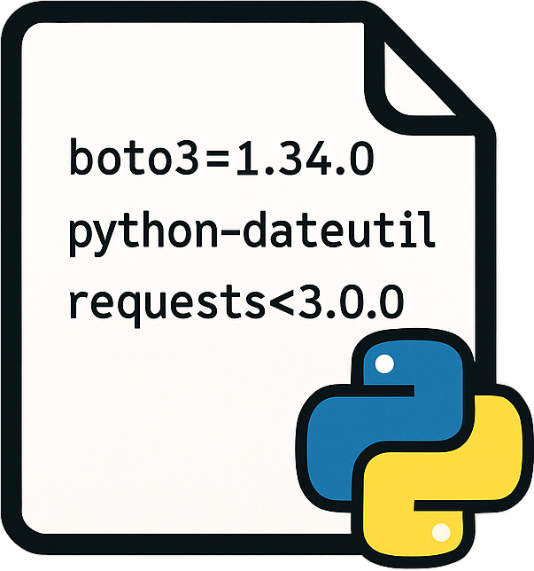

# Requirements CLI



[](https://github.com/CaptainDriftwood/requirements/actions/workflows/ci.yml)
[](https://www.python.org/downloads/)
[](https://github.com/astral-sh/ruff)
[](https://github.com/astral-sh/ty)
[](https://opensource.org/licenses/MIT)

A command line tool designed to manage `requirements.txt` files in Python projects, particularly useful for monorepo style projects.  
It provides functionalities to add, update, remove, find, sort, and view packages in `requirements.txt` files across specified paths.

## Features

- **Add**: Add a new package to `requirements.txt` files
- **Find**: Find a package in `requirements.txt` files across your project
- **Update**: Update an existing package to a new version
- **Remove**: Remove a package from `requirements.txt` files
- **Sort**: Sort packages alphabetically in `requirements.txt` files
- **Cat**: View the contents of `requirements.txt` files

## Installation

This project requires Python 3.11 or higher.

### Install from GitHub (Recommended)

Using **uv** (recommended for CLI tools):
```bash
uv tool install git+https://github.com/CaptainDriftwood/requirements.git
```

Using **pipx** (alternative for CLI tools):
```bash
pipx install git+https://github.com/CaptainDriftwood/requirements.git
```

Using **pip**:
```bash
pip install git+https://github.com/CaptainDriftwood/requirements.git
```

### Install from Local Clone

```bash
git clone https://github.com/CaptainDriftwood/requirements.git
cd requirements
pip install .
```

## Usage

### Basic Commands

#### View contents of requirements.txt files
```bash
requirements cat
```
Outputs the contents of all `requirements.txt` files in the current directory and subdirectories.

```bash
requirements cat /path/to/project
```
View requirements files in a specific path.

```bash
requirements cat /path1 /path2
```
View requirements files in multiple paths.

#### Find a package
```bash
requirements find pandas
```
Find which `requirements.txt` files contain the pandas package.

```bash
requirements find pandas --verbose
```
Show detailed information about where the package is found (displays the actual line from the file).

```bash
requirements find django /path/to/monorepo
```
Search for packages in a specific directory.

#### Add a package
```bash
requirements add requests
```
Add the requests package to all `requirements.txt` files in the current directory.

```bash
requirements add "requests>=2.25.0"
```
Add requests with a specific version constraint.

```bash
requirements add flask --preview
```
Preview changes before applying them.

```bash
requirements add numpy /path/to/project
```
Add a package to requirements files in a specific path.

#### Update a package
```bash
requirements update requests "2.28.0"
```
Update requests to version 2.28.0 (automatically adds == if no operator specified).

```bash
requirements update pandas ">=1.5.0"
```
Update pandas with a version constraint.

```bash
requirements update django "4.2.0" --preview
```
Preview update changes before applying.

```bash
requirements update flask "2.3.0" /path/to/project
```
Update a package in a specific path.

#### Remove a package
```bash
requirements remove requests
```
Remove requests from all `requirements.txt` files.

```bash
requirements remove flask --preview
```
Preview which files would be modified before removing.

```bash
requirements remove django /path/to/project
```
Remove a package from requirements files in a specific path.

#### Sort packages
```bash
requirements sort
```
Sort all packages alphabetically in `requirements.txt` files.

```bash
requirements sort --preview
```
Preview sorting changes before applying.

```bash
requirements sort /path/to/project
```
Sort requirements files in a specific path.

### Advanced Usage

#### Working with multiple paths
```bash
requirements update numpy "1.21.0" /project1 /project2
```
Apply changes to multiple specific paths.

```bash
requirements find django /path1 /path2 /path3
```
Search across multiple directories.

#### Preview mode
Most commands support `--preview` to show what changes would be made without applying them:
```bash
requirements add fastapi --preview
requirements remove flask --preview
requirements sort --preview
requirements update requests "2.28.0" --preview
```

### Command Options

Available options by command:

**All commands:**
- `paths` (positional): Specify custom paths to search (default: current directory)
- `--help`: Show command-specific help

**add, remove, update, sort:**
- `--preview`: Show what changes would be made without applying them

**find:**
- `--verbose`: Show the actual package line from the requirements file

### Examples

#### Monorepo workflow
```bash
# Find all uses of an old package
requirements find deprecated-package --verbose

# Update across entire monorepo
requirements update deprecated-package "new-package>=1.0.0"

# Clean up and sort all files
requirements sort

# Verify changes
requirements cat | grep new-package
```

#### Project maintenance
```bash
# Add a new dependency with preview
requirements add "fastapi[all]>=0.68.0" --preview

# Remove unused packages
requirements remove unused-package --preview
requirements remove unused-package

# Keep requirements files organized
requirements sort
```

## Development

### Setup
```bash
git clone https://github.com/CaptainDriftwood/requirements.git
cd requirements
uv sync
```

### Testing
```bash
# Run tests
just test

# Run tests with coverage
uv run pytest --cov=src

# Run linting
just lint

# Format code
just format

# Type checking
just type

# Run all checks (lint, type, test)
just check

# Run tests across Python versions with nox
just nox
```

### Available recipes
```bash
just          # Show available recipes
just test     # Run pytest
just lint     # Run ruff linter
just format   # Format code with ruff
just type     # Run mypy type checking
just check    # Run all quality checks
just nox      # Run tests across Python 3.11, 3.12, 3.13
just build    # Build the package
just install  # Install in development mode
just clean    # Clean build artifacts
just upgrade  # Upgrade dependencies
```

## License

This project is licensed under the MIT License.

## Contributing

Contributions are welcome! Please feel free to submit a Pull Request.