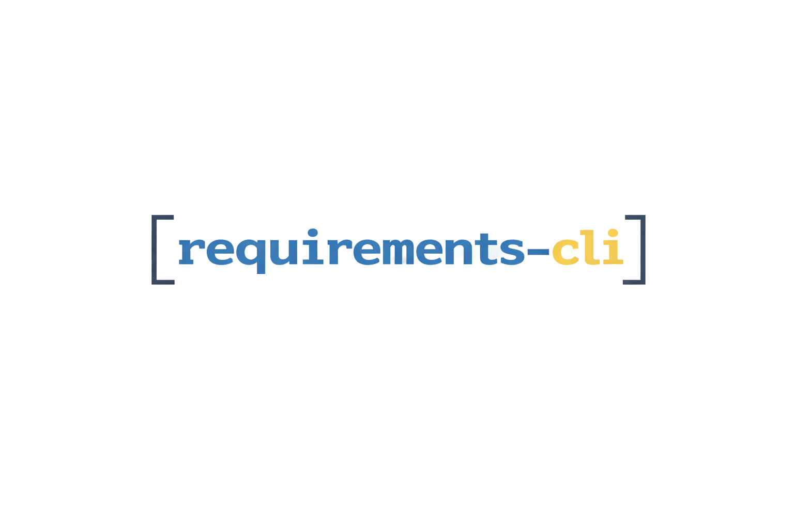

<p align="center">
  
</p>

[](https://github.com/CaptainDriftwood/requirements-cli/actions/workflows/ci.yml)
[](https://codecov.io/gh/CaptainDriftwood/requirements-cli)
[](https://www.python.org/downloads/)
[](https://github.com/astral-sh/uv)
[](https://github.com/astral-sh/ruff)
[](https://github.com/astral-sh/ty)
[](https://nox.thea.codes/)
[](https://click.palletsprojects.com/)
[](LICENSE)

A command line tool designed to manage `requirements.txt` files in Python projects, particularly useful for monorepo style projects.
It provides functionalities to add, update, remove, find, sort, and view packages in `requirements.txt` files across specified paths.

- [Features](#features)
- [Installation](#installation)
- [Usage](#usage)
  - [Basic Commands](#basic-commands)
  - [Advanced Usage](#advanced-usage)
  - [Command Options](#command-options)
  - [Examples](#examples)
  - [Version Specifier Examples](#version-specifier-examples)
  - [Inline Comment Preservation](#inline-comment-preservation)
  - [Excluded Paths](#excluded-paths)
- [Development](#development)
- [References](#references)
- [License](#license)
- [Contributing](#contributing)

## Features

- **Add**: Add a new package to `requirements.txt` files
- **Find**: Find a package in `requirements.txt` files across your project
- **Update**: Update an existing package to a new version
- **Remove**: Remove a package from `requirements.txt` files
- **Sort**: Sort packages alphabetically in `requirements.txt` files
- **Cat**: View the contents of `requirements.txt` files
- **Versions**: Query available versions from PyPI or private indexes
- **Smart exclusions**: Automatically skips `.venv`, `venv`, `virtualenv`, and `.aws-sam` directories
- **URL support**: Handles VCS URLs (`git+https://...`) and PEP 440 URL requirements

## Installation

This project requires Python 3.11 or higher.

### Install from GitHub (Recommended)

Using **uv** (recommended for CLI tools):
```bash
uv tool install git+https://github.com/CaptainDriftwood/requirements-cli.git
```

Using **pipx** (alternative for CLI tools):
```bash
pipx install git+https://github.com/CaptainDriftwood/requirements-cli.git
```

Using **pip**:
```bash
pip install git+https://github.com/CaptainDriftwood/requirements-cli.git
```

### Install from Local Clone

```bash
git clone https://github.com/CaptainDriftwood/requirements-cli.git
cd requirements-cli
pip install .
```

## Usage

### Basic Commands

#### View contents of requirements.txt files
```bash
requirements cat
```
Outputs the contents of all `requirements.txt` files in the current directory and subdirectories.

```bash
requirements cat /path/to/project
```
View requirements files in a specific path.

```bash
requirements cat /path1 /path2
```
View requirements files in multiple paths.

#### Find a package
```bash
requirements find pandas
```
Find which `requirements.txt` files contain the pandas package.

```bash
requirements find pandas --verbose
```
Show detailed information about where the package is found (displays the actual line from the file).

```bash
requirements find django /path/to/monorepo
```
Search for packages in a specific directory.

#### Add a package
```bash
requirements add requests
```
Add the requests package to all `requirements.txt` files in the current directory.

```bash
requirements add "requests>=2.25.0"
```
Add requests with a specific version constraint.

```bash
requirements add flask --preview
```
Preview changes before applying them.

```bash
requirements add numpy /path/to/project
```
Add a package to requirements files in a specific path.

#### Update a package
```bash
requirements update requests "2.28.0"
```
Update requests to version 2.28.0 (automatically adds == if no operator specified).

```bash
requirements update pandas ">=1.5.0"
```
Update pandas with a version constraint.

```bash
requirements update django "4.2.0" --preview
```
Preview update changes before applying.

```bash
requirements update flask "2.3.0" /path/to/project
```
Update a package in a specific path.

#### Remove a package
```bash
requirements remove requests
```
Remove requests from all `requirements.txt` files.

```bash
requirements remove flask --preview
```
Preview which files would be modified before removing.

```bash
requirements remove django /path/to/project
```
Remove a package from requirements files in a specific path.

#### Sort packages
```bash
requirements sort
```
Sort all packages alphabetically in `requirements.txt` files.

```bash
requirements sort --preview
```
Preview sorting changes before applying.

```bash
requirements sort /path/to/project
```
Sort requirements files in a specific path.

#### Query package versions
```bash
requirements versions requests
```
Show the 10 most recent versions of a package from PyPI.

```bash
requirements versions django --all
```
Show all available versions.

```bash
requirements versions requests --limit 20
```
Show a specific number of versions.

```bash
requirements versions mypackage --index-url https://nexus.example.com/repository/pypi/simple
```
Query versions from a private index (Nexus, Artifactory, etc.).

```bash
requirements versions requests -1
```
Print each version on its own line (useful for piping to other commands).

```bash
requirements versions requests -1 | head -5
requirements versions django --all -1 | grep "^4\."
```
Pipe output to other commands for filtering.

### Advanced Usage

#### Working with multiple paths
```bash
requirements update numpy "1.21.0" /project1 /project2
```
Apply changes to multiple specific paths.

```bash
requirements find django /path1 /path2 /path3
```
Search across multiple directories.

#### Preview mode
Most commands support `--preview` to show what changes would be made without applying them:
```bash
requirements add fastapi --preview
requirements remove flask --preview
requirements sort --preview
requirements update requests "2.28.0" --preview
```

### Command Options

**Global options (apply to all commands):**
- `--version`: Show the version and exit
- `--help`: Show help message
- `--color / --no-color`: Enable or disable colored output (auto-detected by default)

**All commands:**
- `paths` (positional): Specify custom paths to search (default: current directory)

**add, remove, update, sort:**
- `--preview`: Show what changes would be made without applying them

**find:**
- `--verbose`: Show the actual package line from the requirements file

**versions:**
- `--all`: Show all available versions (default: 10 most recent)
- `--limit N`: Number of versions to show (default: 10)
- `-1` / `--one-per-line`: Print each version on its own line
- `--index-url URL`: Custom PyPI index URL (e.g., private Nexus repository)

### Color Output

The CLI supports colored output using the [Rich](https://rich.readthedocs.io/) library for enhanced readability.

**Auto-detection (default):**
Colors are automatically enabled when running in a terminal that supports them.

**Manual control:**
```bash
# Force colors on
requirements --color cat

# Force colors off
requirements --no-color cat
```

**Environment variable:**
The CLI respects the `NO_COLOR` environment variable ([no-color.org](https://no-color.org/)):
```bash
# Disable colors via environment
export NO_COLOR=1
requirements cat
```

**Priority order:**
1. `--color/--no-color` flags (highest priority)
2. `NO_COLOR` environment variable
3. User config file (`~/.requirements/config.toml`)
4. Auto-detection (default)

### Configuration

The CLI supports a flexible configuration system with multiple sources, merged in priority order.

#### Configuration Hierarchy

Settings are loaded and merged from multiple sources (highest to lowest priority):

1. **CLI arguments** (`--index-url`, `--color`)
2. **Environment variables** (`REQUIREMENTS_CLI_*`, `PIP_INDEX_URL`)
3. **Project config** (`pyproject.toml` `[tool.requirements-cli]` section)
4. **User config** (`~/.requirements/config.toml`)
5. **pip.conf** (standard pip configuration files)
6. **Defaults** (`https://pypi.org/simple/`)

#### User Configuration File

The CLI supports a user configuration file at `~/.requirements/config.toml`.

**Initialize config file:**
```bash
requirements config init
```

**Set configuration values:**
```bash
# Enable colors
requirements config set color.enabled true

# Set custom PyPI index URL
requirements config set pypi.index_url https://nexus.example.com/simple/

# Set fallback URL (used when primary fails)
requirements config set pypi.fallback_url https://pypi.org/simple/

# Set multiple extra index URLs (comma-separated)
requirements config set pypi.extra_index_urls "https://extra1.com/simple/,https://extra2.com/simple/"
```

**Remove configuration values (reset to default):**
```bash
requirements config unset pypi.index_url
```

**View current settings:**
```bash
requirements config show
```

**View resolved configuration (shows all sources):**
```bash
requirements config resolved
```

**Example user config (`~/.requirements/config.toml`):**
```toml
[color]
enabled = true

[pypi]
index_url = "https://nexus.example.com/simple/"
fallback_url = "https://pypi.org/simple/"
extra_index_urls = ["https://private.example.com/simple/"]
```

#### Project Configuration (pyproject.toml)

Configure settings per-project using `pyproject.toml`:

```toml
[tool.requirements-cli]
color = true

[tool.requirements-cli.pypi]
index_url = "https://private.company.com/simple/"
fallback_url = "https://pypi.org/simple/"
extra_index_urls = [
    "https://team-packages.company.com/simple/",
]
```

This allows different projects to use different PyPI indexes without changing global settings.

#### Environment Variables

The CLI respects the following environment variables:

| Variable | Description |
|----------|-------------|
| `REQUIREMENTS_CLI_INDEX_URL` | Primary index URL (highest priority) |
| `REQUIREMENTS_CLI_FALLBACK_URL` | Fallback URL for network errors |
| `REQUIREMENTS_CLI_EXTRA_INDEX_URLS` | Comma-separated extra index URLs |
| `REQUIREMENTS_CLI_COLOR` | Enable/disable colors (`true`/`false`) |
| `PIP_INDEX_URL` | Fallback for index URL (lower priority) |
| `PIP_EXTRA_INDEX_URL` | Space-separated extra index URLs (lower priority) |
| `NO_COLOR` | Disable colors ([no-color.org](https://no-color.org/)) |

**Example:**
```bash
# Use private index for this session
export REQUIREMENTS_CLI_INDEX_URL=https://private.company.com/simple/
requirements versions mypackage

# Or inline
REQUIREMENTS_CLI_INDEX_URL=https://private.example.com/simple/ requirements versions mypackage
```

#### pip.conf Integration

The CLI automatically reads index settings from standard pip configuration files:

**Locations checked (in order):**
- System: `/etc/pip.conf` (Linux/macOS) or `C:\ProgramData\pip\pip.ini` (Windows)
- User: `~/.config/pip/pip.conf` or `~/.pip/pip.conf`
- Virtualenv: `$VIRTUAL_ENV/pip.conf`

**Example pip.conf:**
```ini
[global]
index-url = https://pypi.company.com/simple/
extra-index-url =
    https://private.company.com/simple/
    https://team.company.com/simple/
```

pip.conf settings have the lowest priority and are overridden by user config, project config, environment variables, and CLI arguments.

#### Available Settings

| Setting | Type | Description |
|---------|------|-------------|
| `color.enabled` | bool | Enable/disable colored output |
| `pypi.index_url` | URL | Primary PyPI index URL for version queries |
| `pypi.fallback_url` | URL | Fallback URL if primary fails (network errors only) |
| `pypi.extra_index_urls` | URL list | Additional index URLs to search |

#### Index URL Search Order

When querying package versions, URLs are tried in this order:

1. `index_url` (primary)
2. Each URL in `extra_index_urls` (in order)
3. `fallback_url` (only on network errors, not 404s)

A 404 response means the package doesn't exist at that index and moves to the next URL. Network errors (connection refused, timeout) trigger the fallback.

### Examples

#### Monorepo workflow
```bash
# Find all uses of an old package
requirements find deprecated-package --verbose

# Update across entire monorepo
requirements update deprecated-package "new-package>=1.0.0"

# Clean up and sort all files
requirements sort

# Verify changes
requirements cat | grep new-package
```

#### Project maintenance
```bash
# Add a new dependency with preview
requirements add "fastapi[all]>=0.68.0" --preview

# Remove unused packages
requirements remove unused-package --preview
requirements remove unused-package

# Keep requirements files organized
requirements sort
```

### Version Specifier Examples

The CLI supports all PEP 440 version specifiers:

```bash
# Exact version (== is added automatically if no operator)
requirements update django 4.2.0        # becomes django==4.2.0

# Minimum version
requirements update django ">=4.2.0"

# Compatible release (allows patch updates)
requirements update django "~=4.2.0"    # allows 4.2.x but not 4.3.0

# Maximum version
requirements update django "<5.0.0"

# Exclusion
requirements update django "!=4.1.0"

# Range constraints
requirements update django ">=4.0.0,<5.0.0"

# Multiple constraints
requirements update requests ">=2.25.0,!=2.26.0,<3.0.0"

# Pre-release versions
requirements update django ">=4.2.0a1"

# Local version identifiers
requirements update mypackage "==1.0.0+local"
```

### Inline Comment Preservation

Inline comments on package lines are preserved when updating versions:

```bash
# Before
django==3.2  # LTS version
flask==2.0

# After running: requirements update django 4.2
django==4.2  # LTS version
flask==2.0
```

Note: Standalone comment lines (lines starting with `#`) are removed during sorting operations. Only inline comments attached to package lines are preserved.

### Excluded Paths

The following are automatically excluded from searches:

**Directories:**
- `.venv`, `venv`, `virtualenv` - Virtual environment directories
- `.aws-sam` - AWS SAM build directories

**Symlinks:**
- Symlinked files are skipped to prevent infinite loops and unexpected behavior

## Development

### Setup
```bash
git clone https://github.com/CaptainDriftwood/requirements-cli.git
cd requirements-cli
uv sync
```

### Testing
```bash
# Run tests
just test

# Run tests with coverage
uv run pytest --cov=src

# Run linting
just lint

# Format code
just format

# Type checking
just type

# Run all checks (format, lint, type, test)
just check

# Run tests across Python versions with nox
just nox
```

### Available recipes
```bash
just                  # Show available recipes
just test             # Run all tests
just test-quick       # Run tests with minimal output
just test-unit        # Run only unit tests (fast, ~0.04s)
just test-integration # Run only integration tests (~0.2s)
just lint             # Run ruff linter
just format           # Format code with ruff
just type             # Run ty type checking
just check            # Run all quality checks
just nox              # Run tests across Python 3.11, 3.12, 3.13, 3.14
just build            # Build the package
just install          # Install in development mode
just clean            # Clean build artifacts
just upgrade          # Upgrade dependencies
```

## References

- [Click](https://click.palletsprojects.com/) - CLI framework
- [Rich](https://rich.readthedocs.io/) - Terminal formatting and colors
- [uv](https://docs.astral.sh/uv/) - Python package manager
- [Ruff](https://docs.astral.sh/ruff/) - Linter and formatter
- [ty](https://github.com/astral-sh/ty) - Type checker
- [just](https://just.systems/) - Command runner
- [Nox](https://nox.thea.codes/) - Test automation

## License

This project is licensed under the MIT License.

## Contributing

Contributions are welcome! Please feel free to submit a Pull Request.